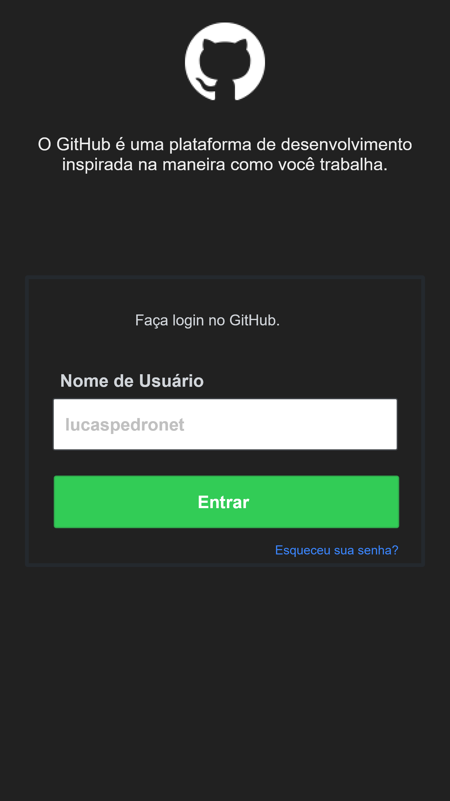

# atividade-movimento-ti
Apresentação: Atividade proposta no curso de react-native no evento Movimento TI no CEULP/Ulbra.

### Atividade 01
Crie uma aplicação do zero com nome de projeto **myGitHub**  você deve reproduzir o layout abaixo utilizando FlexBox layout:

Nesse projeto você desenvolverá uma tela de Login como a ilustrada acima e Feed  de posts estilo Facebook. Crie um layout tentando chegar o mais próximo possível da imagem acima

**Atenção**: Não é obrigatório desenvolver o layout da tela de Feed, mas caso queira, você pode acessar  [Tela Feed repositorios](./assests/Repositorios.png).

### Metricas do Projeto:
### Regras:
### Dicas:
### Entregar: